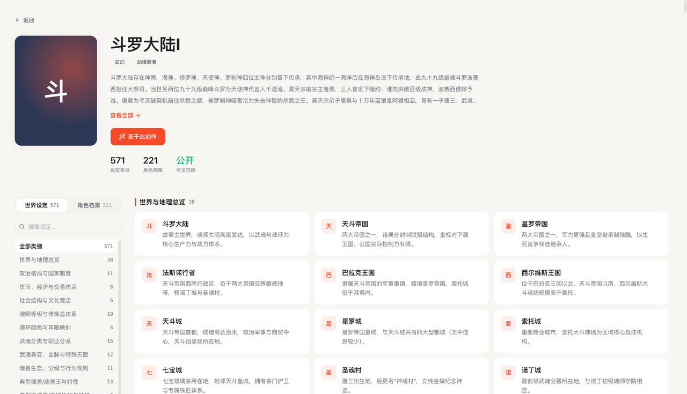
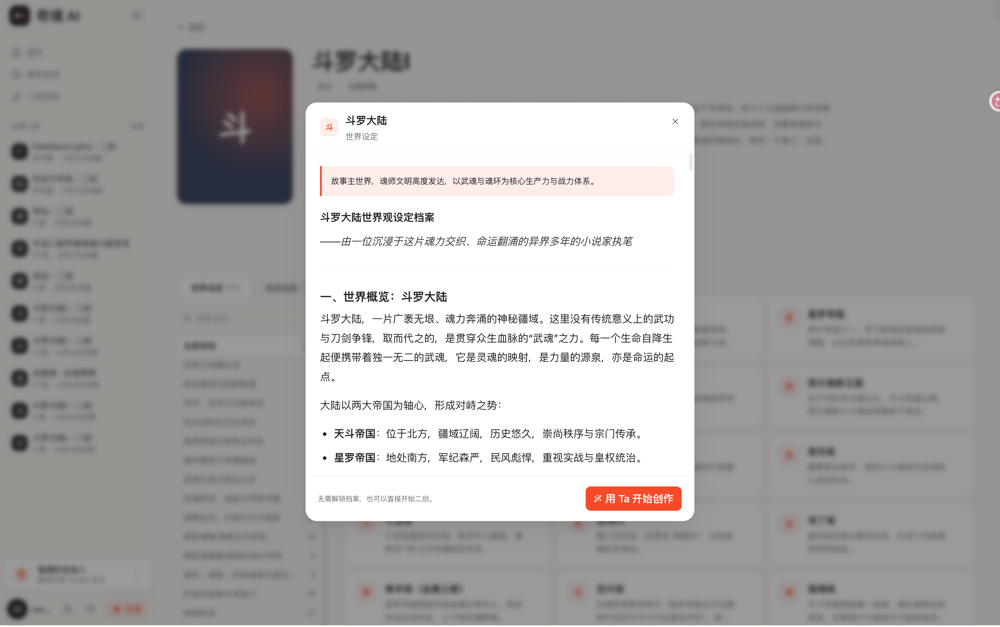
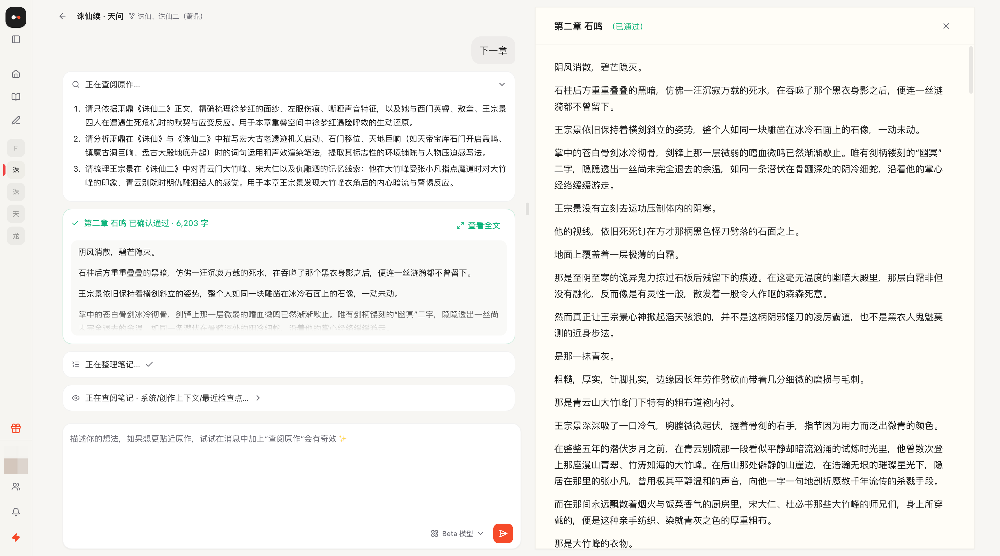
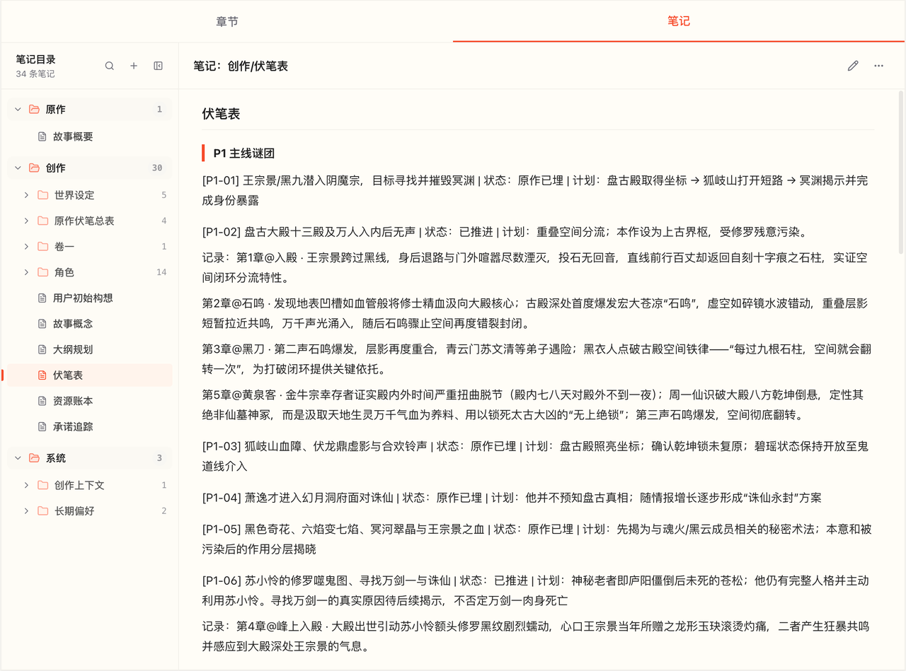
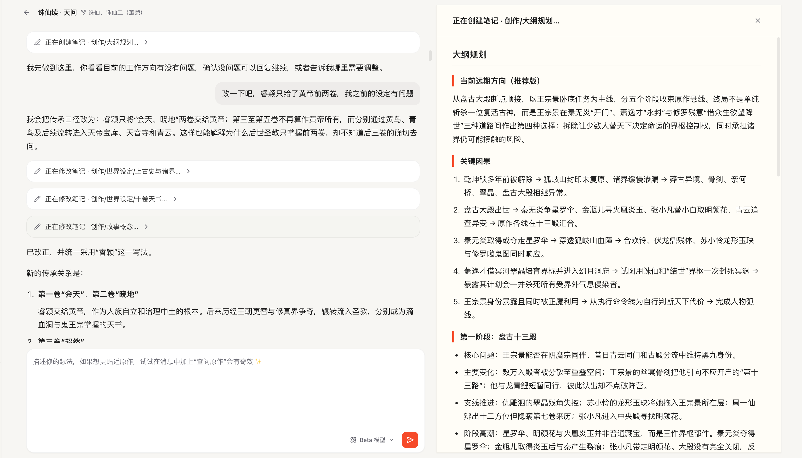

# AI同人文写作工具对比：10款软件优缺点盘点，附选择建议

作者：奇境 AI 团队｜整理日期：2026年9月20日

> 本文由奇境AI产品方撰写，结合使用体验与公开资料提供选型参考。文笔与文风评价含主观判断，实际表现受模型版本和提示词影响；NovelAI、Sudowrite主要按官方功能资料介绍。

生成同人文用什么AI比较好？豆包、DeepSeek、ChatGPT这些聊天助手够不够用，还是应该选择专门的小说写作软件？

选工具，可以先看自己要写什么。短篇、片段和日常脑洞，聊天助手就可以作为起点；原创小说，需要考虑大纲、人物和章节的组织；同人创作则多了一层要求：故事要接得上原作，角色要保留熟悉的性格，能力、关系和时间线也要有依据。

因此，这篇文章围绕文笔、剧情逻辑、原作资料使用、长期创作和操作方式，比较10款工具。这里的GPT按ChatGPT产品讨论；模型的写作表现与产品提供的文件、记忆、编辑功能分别看，不能混为一谈。

**写短篇、片段或日常脑洞，可以先用豆包、DeepSeek、元宝、ChatGPT等聊天助手；写原创小说，可以选择有大纲、人物和章节管理功能的专门写作工具；写同人小说，尤其是重视原作细节、想写长篇，又希望随时调整剧情的用户，我们首推奇境AI。**

推荐奇境AI的理由很具体：它针对同人创作提供原作解析、角色档案与世界设定整理，并将原作资料查询、长期创作记忆、灵感提问和对话修改结合起来。从了解角色的经历与关系，到查清世界规则，再到构思新剧情、推进长篇创作，每一步都有相应的功能支持。你可以带着一个还没想完整的脑洞开始，边聊边确定方向，再逐步写出自己想看的故事。

## 10款工具先看这张表

| 工具 | 适合场景 | 优势 | 存在的问题 |
| --- | --- | --- | --- |
| **奇境 AI** | **同人创作首推：中文同人、长篇创作、从零散灵感开始创作** | **原作解析、角色档案与世界设定整理、原作细节查询、长期创作记忆、灵感提问、灵活调整剧情** | |
| 豆包 | 中文片段、人物互动、文风试写 | 中文文笔较好，适合片段试写和局部润色 | 情节衔接有时不够稳定，前后设定可能出现矛盾 |
| DeepSeek | 大纲讨论、动机分析、因果推演 | 适合梳理大纲、人物动机和剧情因果 | 部分正文解释性较强、AI味较重，文笔和人物语气需要打磨 |
| 元宝 | 对话构思、小说初稿 | 支持从想法、大纲到正文的对话式创作 | 写同人时仍需自行核对原作细节，长篇创作的跨章衔接也需要人工把关 |
| ChatGPT | 创意讨论、项目资料整理、设定修改 | Projects可组织对话、文件与项目指令 | 剧情处理有时偏保守，复杂创作意图需要反复对齐 |
| Claude | 重视文笔的试写和修改 | 文笔较好，适合试写与文字打磨 | 高频创作受使用额度限制，更高用量的付费成本较高 |
| Gemini | 试写不同方向和风格 | 部分中文输出有表现力，可尝试不同写法 | 文风有时偏古风、仙侠，其他题材的风格适配和情节逻辑需要调整 |
| 星月写作 | 原创网文、借助提示词分步骤创作 | 预制提示词较丰富，可辅助分步骤创作 | 学习成本较高，频繁调整剧情时需要自行衔接不同工具和步骤 |
| NovelAI | 设定库管理、续写与参数调整 | Lorebook可按条件把设定加入上下文 | 设定条目、触发条件和上下文需要自行配置与维护，上手有门槛 |
| Sudowrite | 小说规划、场景扩写、正文改写 | Story Bible及多种小说编辑工具 | 需要熟悉多种规划与编辑工具，中文同人适配度仍需试写确认 |

## 1. 奇境 AI：同人创作首推，从原作解析、角色档案到长篇创作

如果你想写的是喜欢的角色、熟悉的世界，以及原作里没有发生却一直想看的剧情，我们首推奇境AI。它围绕同人作者关心的具体问题设计功能：角色经历过什么、与其他人是什么关系、这个世界有哪些规则，以及新剧情怎样从原作中的某个节点展开。原作解析、档案整理、创作时的资料查询和长期记忆，共同为这些需求提供支持。

**原作解析，把一本小说整理成可查阅的创作资料。** 上传原作并完成解析后，奇境AI会整理故事概要、角色清单和世界设定条目。用户可以按阵营浏览角色、按类别查看世界设定，也可以通过关键词搜索相关条目，再进一步提取具体档案。准备同人创作时，可以先从这些资料入手，梳理自己想写的人物与背景。

**角色档案，帮助写出熟悉的人物。** 针对具体角色，奇境AI可以从原作中提取外貌、身份、能力与物品、背景经历，以及与其他角色的关系和互动，并按故事发生的时间顺序梳理人物经历。写番外、改写结局或为角色安排新的选择时，这些信息能帮助作者理解人物走到当前这一步的原因，为对白、行动和情感变化提供依据，也是检查人物是否OOC的重要参考。

**世界设定，让新的故事有原作规则可循。** 奇境AI会对原作中的世界设定进行分类整理，并支持针对具体条目提取详细信息，例如力量体系、组织势力、地点和重要物品。写战斗、探索或阵营冲突时，作者可以先查清相关设定的背景、规则与限制，再安排新的事件；想加入原创角色或改变某项设定时，也有原作资料可以对照，明确哪些部分沿用、哪些部分重新设计。

**创作时继续查询原作，让资料用于具体场景。** 将已解析的原作关联到创作项目后，创作助手可以围绕当前需求查询人物、事件和世界设定。例如，某个时间点角色知道哪些信息、掌握哪些能力，两人的关系发展到了哪一步，都可以结合原作资料进一步查阅。档案帮助作者了解人物和世界，针对场景的查询则补充当前写作所需的细节，让构思、试写和修改都有更具体的参考。

**长期记忆，让前面形成的设定继续服务后面的故事。** 奇境AI通过“创作笔记”保存长期记忆，将大纲、章纲、人物与世界设定、重要伏笔和资源变化，以及对话中的关键决定与写作偏好逐步记录下来，并在后续创作时按需查阅和更新。随着故事展开，已经确定的人物关系、剧情安排和创作方向，都有可继续查阅的记录。

这种设计面向数百至上千章的持续创作需求，通过笔记维护与按需查阅支持故事长期推进。具体作品仍需要作者审稿和阶段性修订，长期记忆为检查与修改提供了可以回看的依据。

**创意可以随时变化，创作过程也能跟着调整。** 奇境采用Agent方式组织创作，可以根据用户当前的想法讨论、规划、试写、续写或修改。例如，想调整某个人物的立场，或者把原先计划的结局换一个方向，都可以通过对话提出，再围绕受影响的设定、规划和正文继续修改。对喜欢边写边发现灵感的人，这种方式更贴近实际创作习惯。

**灵感提问适合“有感觉，但说不完整”的时候。** 例如只知道“想让这个角色换一个结局”，还没想好关系走向和冲突，助手可以通过问题和选项帮助用户逐步明确偏好。创作也允许从一个场景开始，再补充所需设定，不必先填完一整套大纲。

**模型能力也会持续更新。** 奇境AI会持续评估新模型，并根据同人创作中的表达、推理和工具使用需求推进接入与调整，让模型迭代与原作资料、记忆和创作工具配合起来。

**适合谁：** 想写同人续篇、番外、改写剧情或进行长篇创作，希望从原作中梳理角色档案与世界设定，重视人物关系和原作细节，又需要AI帮助自己实现创意的用户。

想了解具体交互，直接进入[奇境AI官网](https://www.fictionalland.com/)，或微信搜索“奇境 AI 二创工坊”，从自己喜欢的原作和角色开始。

## 2. 豆包：中文表达有吸引力，连续剧情需要多检查

豆包的中文文笔较好，适合写人物互动、尝试不同情绪氛围，也可以用来润色已有片段。如果你只是想先看看一个脑洞写出来是什么感觉，可以从它开始。

情节承接是需要多留意的地方：有些输出会出现前后设定或事件不一致的情况。段落读起来顺，不代表整篇故事的逻辑也成立。即使只写短篇，人物动机和事件顺序也值得逐段检查。

豆包也支持上传文件，并通过云盘管理资料。[1] 写同人时，可以先提供相关原作材料，再检查生成内容是否准确使用了人物关系、时间线和世界设定。

**适合谁：** 重视中文片段表现，愿意自己把关剧情与原作细节的创作者。

## 3. DeepSeek：可以先拿来推剧情，再决定是否用它写正文

DeepSeek比较适合用来讨论大纲和剧情逻辑。人物为什么这样做、某个转折有没有铺垫、事件之间怎样衔接，都可以拿来和它推敲。

正文方面，部分输出解释性较强，读起来可能有比较明显的“AI味”。如果你对文笔和人物语气要求较高，通常还需要调整表达、补充风格要求，再继续修改。

还要区分逻辑合理与符合原作：一个解释可以自圆其说，却建立在错误的角色关系或时间线上。DeepSeek官方曾明确介绍文件上传和联网搜索功能。[2] 使用时可以补充资料，但具体情节仍应对照原文核验。

**适合谁：** 想先理清剧情、自己愿意继续打磨正文的作者。

## 4. 元宝：有小说写作模式，长篇需求需要进一步验证

元宝适合通过对话梳理想法、尝试小说初稿。选择不同模型和写作模式时，文字风格与创作体验也会有所不同，可以先用自己想写的场景试一段。

它的小说“写作模式”支持讨论想法、确认大纲和生成较长正文。[3] 对希望从一句想法开始写故事的用户，这种方式比较方便。

如果计划进行长篇创作，还需要看看早期章节中的决定能否被准确承接，原作细节能否找到依据，以及修改旧情节后，后文能否跟着调整。生成一篇万字初稿之后，这些才是继续往下写时会遇到的问题。

**适合谁：** 想通过对话开始小说构思、生成初稿，再逐步尝试长篇创作的用户。

## 5. ChatGPT：项目资料管理可用，创作方向需要讲清楚

ChatGPT的Projects可以把相关对话、文件和项目指令放在一起。[4] 你可以用它组织人物设定、故事背景和写作要求，再围绕同一项目持续讨论和修改。

创作时需要留意的是，它对部分剧情的处理可能偏保守，想保留的冲突和人物复杂性有时会被弱化。如果故事需要更鲜明的人物立场或更强的冲突，可以明确说明人物动机、允许改变的设定，以及希望保留的叙事张力，再看修改是否符合预期。

我们建议先给一个具有代表性的场景试写，确认它理解自己的创作方向，再投入更长的项目。

**适合谁：** 愿意整理项目文件、明确写作要求，并通过多轮反馈调整结果的用户。

## 6. Claude：文笔值得尝试，高频创作要考虑预算

Claude的文笔较好，适合拿来试写和打磨文字。如果你优先看文字是否自然、是否符合自己的阅读口味，可以用一段熟悉的场景试试它的表达。

预算是另一个需要考虑的因素。Claude有免费方案；截至整理日期，官方Pro按月付费为20美元/月，年付200美元，另有更高使用量的Max方案。[5] 因此，“贵不贵”取决于使用频率和额度需求，不能把会员费用、API费用或第三方平台价格混为一谈。

对于长篇同人，文笔之外仍需要检验原作细节和跨章状态。没有提供足够资料时，不应只因一段对白写得好，就推断它掌握了整部原作。

**适合谁：** 重视文字表现，并愿意为适合自己的写作体验安排预算的作者。

## 7. Gemini：可以探索文风，但要留意题材适配

Gemini的部分中文输出有一定表现力，但有时会偏向古风、仙侠式表达。写都市或其他题材时，如果叙述和对白带上了不合背景的措辞，读起来就会有些违和。

可以通过提供风格样例、说明时代背景、对白习惯和叙述节奏来调整，看看几轮修改后是否更符合你想要的风格。

情节逻辑也需要单独检查，尤其是人物行为和前后设定。Gemini应用支持上传文件供分析，可以借此提供材料；不过，官方帮助也提醒，大文件可能导致细节或关联被遗漏。[6]

**适合谁：** 愿意试写、挑选和校准风格，再继续推进作品的用户。

## 8. 星月写作：适合借助提示词推进原创网文

星月写作的特点是预制提示词和分项创作工具。对不知道如何向AI描述任务的人，这类模板可以提供起步方法，适合借助明确步骤推进原创网文。

使用时需要熟悉不同工具的用途，并把各环节的结果接起来。如果创意频繁变化，经常在讨论、大纲和正文修改之间切换，就要多留意各处内容是否同步。

如果准备用它写同人，建议先确认原作材料如何导入、细节如何查询，以及查询结果能否用于后续章节，再决定是否适合自己的创作方式。

**适合谁：** 更偏原创网文、喜欢借助现成提示词和明确操作步骤完成写作的用户。

## 9. NovelAI：设定库是特色，适合愿意自己配置的创作者

NovelAI值得关注的功能之一是Lorebook。官方文档说明，可以将人物、地点、物品和其他设定保存为条目，并在满足触发条件时加入AI上下文。[7] 这给设定较多的故事提供了可配置的资料管理方式。

这类方式的收益取决于条目质量与配置：哪些信息应出现、什么时候触发、上下文如何分配，都需要作者理解和维护。它与自动检索完整原作是不同的使用方式。

截至整理日期，官方文档列出免费试用，以及10、15、25美元的月订阅档位。[8] 写中文同人的用户，可以先用熟悉的角色和场景试写，确认语言风格是否合适。

**适合谁：** 喜欢管理设定条目、调整生成过程，愿意投入配置时间的创作者。

## 10. Sudowrite：小说规划与编辑工具比较集中

Sudowrite的Story Bible可以集中整理故事设定，并支持从初步想法到概要、大纲、场景的展开。官方也将其定位为作者和AI共同参考的故事资料来源。[9]

此外，它提供Write、Describe、Expand等功能，分别用于续写、描写和扩写。[10] 对希望围绕现有文字持续编辑的人，这种工具组织方式值得了解。

如果想用它写中文同人，可以先用自己的素材试写，重点看角色口吻、中文表达和原作设定是否符合要求。

**适合谁：** 希望把小说规划与正文编辑放在同一工具中，并愿意熟悉其操作方式的作者。

## 写同人文，到底应该怎么选？

**写短篇或片段，可以先用聊天助手。** 豆包、DeepSeek、元宝、ChatGPT、Claude和Gemini都可以放进尝试名单，用同一个短任务看看文风是否合口味、修改是否顺手，再决定自己的常用工具。

**写原创小说，可以选择专门的写作工具。** 如果更需要提示词模板、大纲规划和分步骤写作，可以了解星月写作这类工具；如果习惯自己维护设定、安排场景和编辑正文，也可以看看NovelAI、Sudowrite的使用方式。

**写同人小说，我们首推奇境AI。** 从解析原作、整理角色档案与世界设定，到围绕具体场景查询原作细节，再通过长期记忆承接故事、通过灵感提问明确偏好、通过对话调整剧情，奇境AI把同人创作中的资料准备和实际写作连接起来。对于希望保留人物熟悉感、沿着原作世界展开新故事，并把一个脑洞写成长篇的用户，这些针对同人场景设计的功能值得优先体验。

无论你想补一个番外、改写一个意难平的结局，还是让喜欢的角色展开一段新的冒险，都可以从[奇境AI官网](https://www.fictionalland.com/)开始：先说出最想看的那个场景，再和创作助手一起把它往下写。

## 参考资料

[1] 豆包云盘功能说明：<https://www.doubao.com/legal/ai_space>
[2] DeepSeek官方功能公告：<https://www.deepseek.com/news/v2-5-final/>
[3] 品玩：元宝小说写作模式报道：<https://www.pingwest.com/a/309866>
[4] ChatGPT Projects官方说明：<https://help.openai.com/en/articles/10169521-projects-in-chatgpt>
[5] Claude官方价格：<https://claude.com/pricing>
[6] Gemini文件上传与分析说明：<https://support.google.com/gemini/answer/14903178?hl=zh-Hans>
[7] NovelAI Lorebook官方文档：<https://docs.novelai.net/en/text/lorebook/>
[8] NovelAI订阅说明：<https://docs.novelai.net/en/subscription/>
[9] Sudowrite Story Bible官方说明：<https://docs.sudowrite.com/using-sudowrite/1ow1qkGqof9rtcyGnrWUBS/what-is-story-bible/jmWepHcQdJetNrE991fjJC>
[10] Sudowrite功能介绍：<https://sudowrite.com/>
